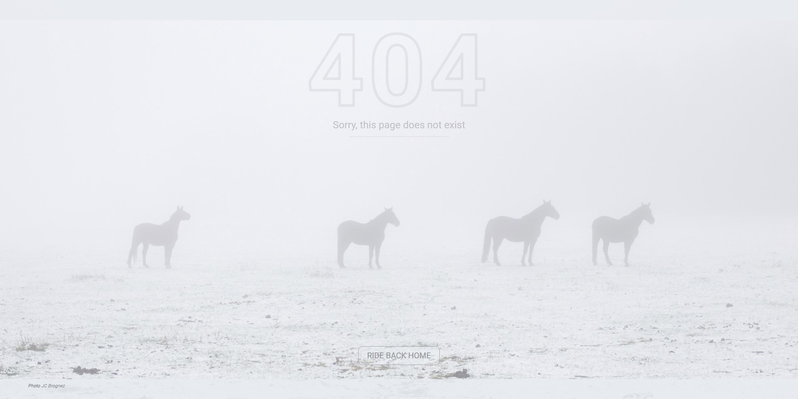

# My Personal 404 Page

[404-Page "Ride Back Home"](https://jcbrognez.github.io/404-Page/)

Creation of a first 404 Page using HTML, CSS and media Query. It's a work being part of my training @Becode.

For this work I built the project around the photograph and worked also the colors to match it. The design is simple and responsive to adapt to a smartphone's screen.

Photography: Horses on belgian countryside, Jean-Charles Brognez
